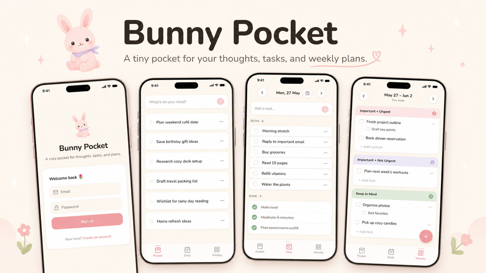

# Bunny Pocket

Bunny Pocket is a cozy, mobile-first planner for capturing thoughts, planning the day, and organizing weekly priorities.

## Functionalities

- Sign in with Supabase authentication.
- Capture quick thoughts and tasks in the Pocket screen.
- Reorder Pocket and Daily items with drag and drop.
- Move Pocket items into Daily with a selected date.
- Move Pocket items into Weekly with a selected priority section.
- Plan Daily tasks by date.
- Add optional reminder times for Daily tasks.
- Mark tasks as done or move them back to todo.
- Edit task titles and details.
- Delete tasks.
- Organize Weekly tasks by week.
- Navigate between previous, current, and future weeks.
- Group Weekly tasks into three sections:
  - Important + Urgent
  - Important + Not Urgent
  - Keep in Mind
- Add subtasks under Weekly tasks.
- Move Weekly tasks into Daily.
- View cute empty, loading, and completion states.
- Use the app as a mobile-friendly PWA with bottom navigation.
